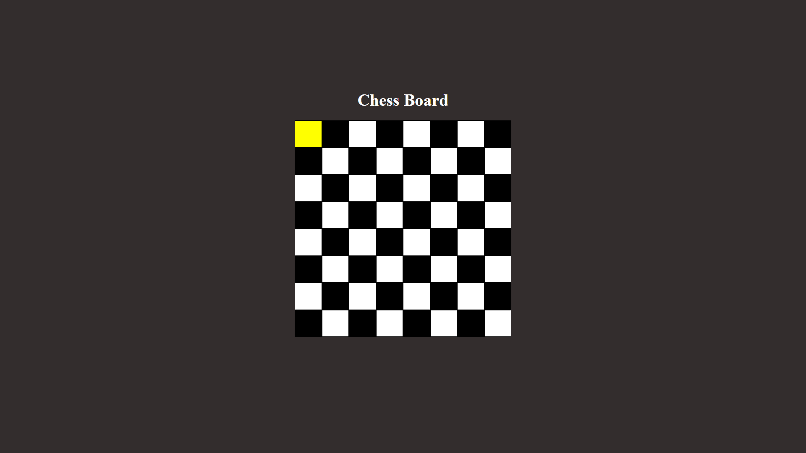
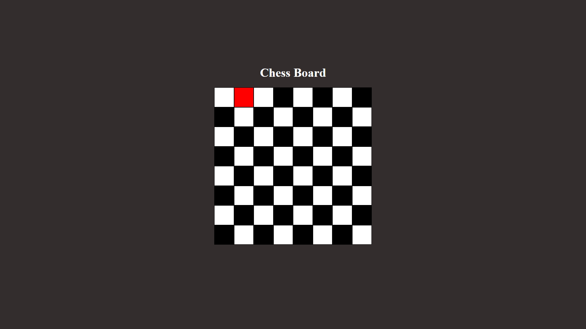

---
# [Developer @EhsaasChaudhary ](https://github.com/EhsaasChaudhary)

---

# Task Description

### Develop a "Chess" board game with redux, with one white and other black color squre which when clicking on white square color change to yellow and black to red

---

# Demo and Screenshots :movie_camera:


---

# Sections :bookmark:

- white-yellow


- black-red


---

# How to run on local:

### You will first need to clone the project from Github into your local system


## <br />

# Getting Started :dart:

### Step 1:
Install node_module using 
```bash
npm install
```

### Step 2:
run the development server:

```bash
npm run dev
```

Open [http://localhost:5173](http://localhost:5173) with your browser to see the result.

---

# Usage :joystick:
## To Use redux/redux toolkit

Goto [npm redux](https://www.npmjs.com/package/redux) and use the following npm command to install redux
```bash
npm install @reduxjs/toolkit react-redux
```

```

